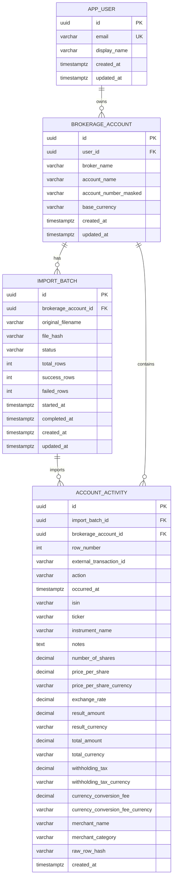

```mermaid
erDiagram
    APP_USER ||--o{ BROKERAGE_ACCOUNT : owns
    BROKERAGE_ACCOUNT ||--o{ IMPORT_BATCH : has
    IMPORT_BATCH ||--o{ ACCOUNT_ACTIVITY : imports
    BROKERAGE_ACCOUNT ||--o{ ACCOUNT_ACTIVITY : contains

    APP_USER {
        uuid id PK
        varchar email UK
        varchar display_name
        timestamptz created_at
        timestamptz updated_at
    }

    BROKERAGE_ACCOUNT {
        uuid id PK
        uuid user_id FK
        varchar broker_name
        varchar account_name
        varchar account_number_masked
        varchar base_currency
        timestamptz created_at
        timestamptz updated_at
    }

    IMPORT_BATCH {
        uuid id PK
        uuid brokerage_account_id FK
        varchar original_filename
        varchar file_hash
        varchar status
        int total_rows
        int success_rows
        int failed_rows
        timestamptz started_at
        timestamptz completed_at
        timestamptz created_at
        timestamptz updated_at
    }

    ACCOUNT_ACTIVITY {
        uuid id PK
        uuid import_batch_id FK
        uuid brokerage_account_id FK
        int row_number
        varchar external_transaction_id
        varchar action
        timestamptz occurred_at
        varchar isin
        varchar ticker
        varchar instrument_name
        text notes
        decimal number_of_shares
        decimal price_per_share
        varchar price_per_share_currency
        decimal exchange_rate
        decimal result_amount
        varchar result_currency
        decimal total_amount
        varchar total_currency
        decimal withholding_tax
        varchar withholding_tax_currency
        decimal currency_conversion_fee
        varchar currency_conversion_fee_currency
        varchar merchant_name
        varchar merchant_category
        varchar raw_row_hash
        timestamptz created_at
    }
```